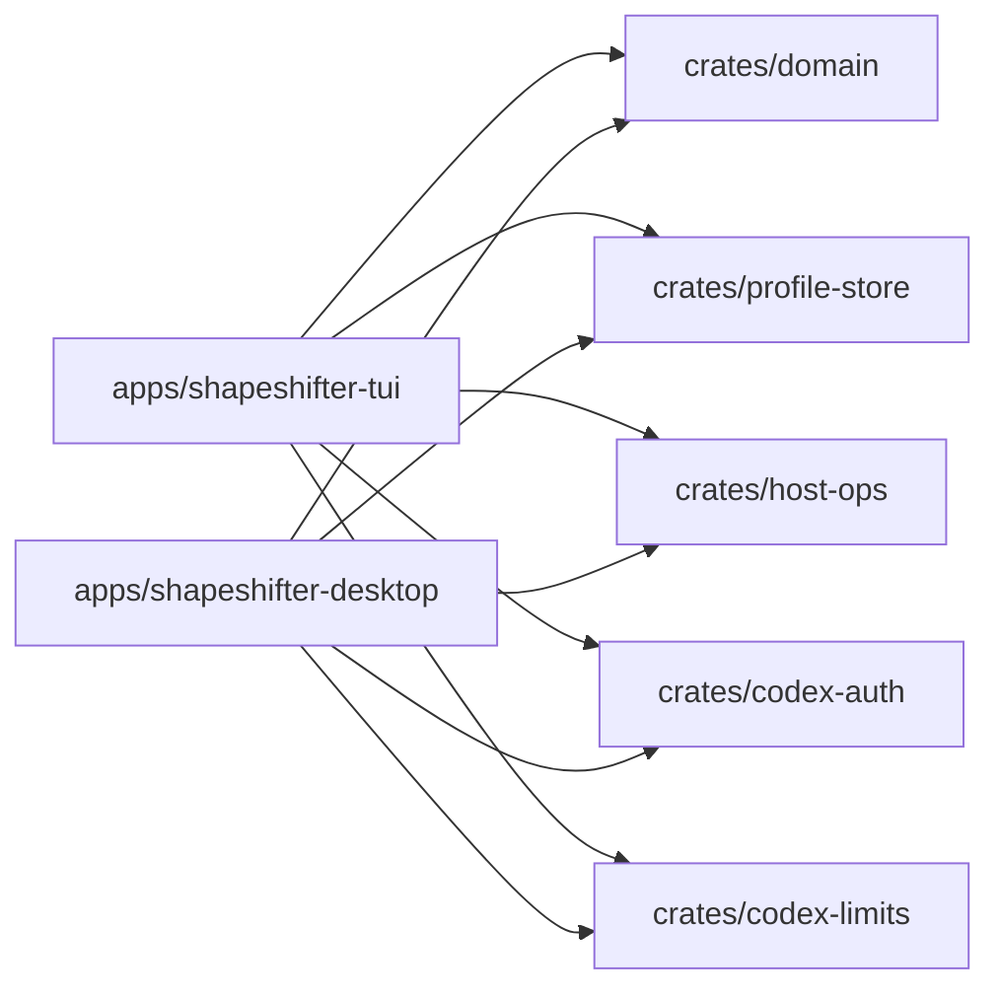

# shapeshifter

A multi-account credential manager for ChatGPT / OpenAI Codex CLI. Switch between saved accounts, deploy them to local or remote machines via SSH, and monitor usage limits — all from a sleek TUI or native desktop app.

[](https://github.com/Fractal-Tess/shapeshifter/actions/workflows/release.yml?query=branch%3Amain+event%3Apush)


## Features

- **Multi-account management** — save, import, export, and delete ChatGPT OAuth profiles.
- **One-click activation** — deploy a profile to your local machine or any remote host over SSH.
- **Usage limit monitoring** — fetch and display 5-hour and weekly Codex usage limits per account.
- **Host management** — manage local and remote targets, sync account stores via rsync.
- **Browser & device login** — OAuth PKCE browser flow or device-code flow for headless setups.
- **Auto-update** — checks GitHub releases on startup, one-key update from the TUI.

## Architecture



| Crate | Purpose |
|-------|---------|
| `apps/shapeshifter-tui` | Ratatui terminal interface with vim keybindings |
| `apps/shapeshifter-desktop` | egui/eframe native desktop app |
| `crates/domain` | Pure data types — `AuthFile`, `AccountProfile`, `ManagedHost`, `LimitsSnapshot` |
| `crates/profile-store` | Disk I/O for profiles, hosts, and `auth.json` |
| `crates/host-ops` | SSH/scp/rsync for remote hosts, local file writes |
| `crates/codex-auth` | OAuth PKCE browser flow and device code flow |
| `crates/codex-limits` | Fetches usage limits from `chatgpt.com/backend-api/codex/usage` |

## Quickstart

### From releases

Download the latest binary from [Releases](https://github.com/Fractal-Tess/shapeshifter/releases):

```bash
# Linux TUI
chmod +x shapeshifter-linux-x86_64-tui
./shapeshifter-linux-x86_64-tui

# Linux Desktop
chmod +x shapeshifter-linux-x86_64
./shapeshifter-linux-x86_64
```

### From source

```bash
git clone https://github.com/Fractal-Tess/shapeshifter.git
cd shapeshifter
cargo run --release -p shapeshifter-tui
```

Or with Nix:

```bash
direnv allow
cargo run --release -p shapeshifter-tui
```

## TUI Keybindings

| Key | Action |
|-----|--------|
| `j` / `k` | Navigate profiles |
| `Space` | Activate selected profile on current host |
| `x` | Toggle mark on profile |
| `X` | Mark / unmark all visible |
| `e` | Export marked (or selected) to clipboard |
| `/` | Search / filter profiles |
| `h` / `l` | Switch hosts |
| `H` | Open host selector |
| `b` | Browser login |
| `d` / `D` | Start / finish device login |
| `i` | Import account(s) from JSON |
| `r` | Refresh usage limits |
| `R` | Reload accounts from disk |
| `s` | Sync accounts to remote host |
| `u` | Update (when available) |
| `?` | Help |
| `q` | Quit |

## Host Setup

Shapeshifter reads hosts from `~/.local/share/shapeshifter/accounts/.hosts`, one per line:

```
vd
neo ~/.codex ~/.local/share/shapeshifter
```

Format: `ssh_alias [auth_file_path [managed_data_dir]]`

The local machine is always available as the first host. Remote hosts use your SSH config for authentication.

Hosts are displayed with `*L` (local) or `*R` (remote) indicators.

## Storage

| Path | Contents |
|------|----------|
| `~/.codex/auth.json` or `~/.local/share/opencode/auth.json` | Active auth credentials |
| `~/.local/share/shapeshifter/accounts/*.json` | Saved account profiles |
| `~/.local/share/shapeshifter/accounts/.hosts` | Remote host list |

## License

[MIT](./LICENSE)
